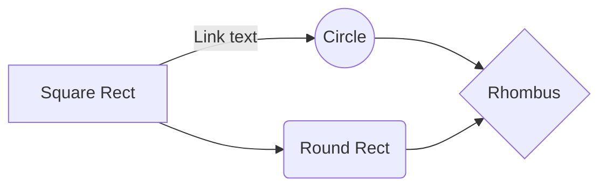

# dinner-and-a-movie

## Table of Contents

1. [Description](#description)
2. [Demo](#demo)
3. [User Story](#user-story)
4. [User Flow Diagram](#user-flow-diagram)
5. [Link to Deployed Page](#link-to-deployed-page)
6. [How to Use the Application](#how-to-use-the-application)
7. [Authors](#authors)

## Description

(More text here)

## Demo

## User Story

## User Flow Diagram

## Link to Deployed Page

[Click here to launch the app!](https://hak9292.github.io/dinner-and-a-movie/)

## How to Use the Application

1. Input a zip-code into the search bar and click "go" or press "Enter" on your keyboard.
2. If you would like to share the generated information, press the "share" button".
	- At this point, your link should have been copied onto your clipboard, and you can paste the link wherever and send.
3. If you would like to generate a different restaurant, please click "Another One!" under the "Restaurant" section.
4. If you would like to generate a different movie theater, please click "Another One!" under the "Movie Theater" section.
5. Repeat step 2 as necessary.
6. Press "Start Over" at the bottom of the page if you would like to start over.

## Authors

* Sam Rapowitz
* Leslie Crouch
* Jasmine Washington
* Hee Hoon Kim