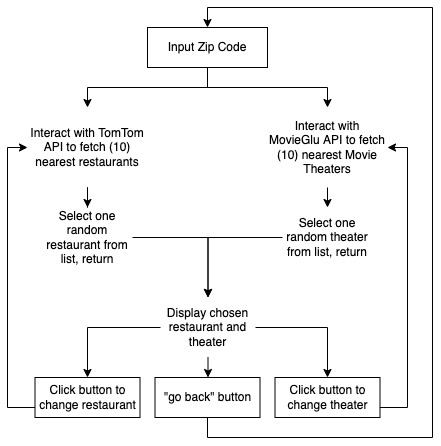

# Dinner and a Movie

## Table of Contents

- [Description](#description)
	- [User Story](#user-story)
	- [Acceptance Criteria](#acceptance-criteria)
	- [Demo](#demo)
	- [User Flow Diagram](#user-flow-diagram)
- [Link to Deployed Page](#link-to-deployed-page)
- [How to Use the Application](#how-to-use-the-application)
- [Authors](#authors)

### Description
How often have you asked "where should we go?" when planning a night out? Probably a few too many times.
To try and address that challenge, we created a web application to give you some 'Dinner and a Movie' recommendations around you. This should at least give you and your partner a good starting point to plan a fun and memorable date night.

For version 1, we collect a list of local eateries and cinemas. We then present them randomly to the date-goer one at a time. The user has the option to reshuffle their options until they get a combination they are happy with, or they can begin again with perhaps a different zip code.

This web app leverages several public APIs to generate a list of local recommendations.
- The [TomTom's search API](https://developer.tomtom.com/search-api/search-api-documentation) helped collect a list of theaters in the area.
- [TomTom's search API](https://developer.tomtom.com/search-api/search-api-documentation) helped us produce a list of nearby restaurants. Currently you can not filter by cuisine type, which can be both an advantage and disadvantage when you are trying to coordinate the perfect evening
- Additionally, [OpenWeather's API](https://openweathermap.org/current#zip) was able to give us coordinates that were necessary for interacting with the other APIs

Future Feature Ideas:


## User Story
```
AS A date-goer
I WANT to be given a movie theater and a restaurant in close proximity to that movie theater
SO THAT I do not have to stress about planning a date on my own
```
## Acceptance Criteria
```
GIVEN an input field
WHEN I input my zip code and click submit
THEN I am presented with a restaurant and a movie theater

WHEN I look at the restaurant
THEN I see the name, cuisine type, and address of the restaurant

WHEN I look at the movie theater
THEN I see the name and address of the movie theater

WHEN I click "Submit"
THEN the zip code, restaurant info, and movie theater info are saved into local storage

WHEN I click "Try Again" under the restaurant that it provides for me
THEN it gives me a new restaurant, and local storage is updated

WHEN I click "Try Again" under the movie theater that it provides for me
THEN it gives me a new movie theater, and local storage is updated

WHEN I click "Share"
THEN a link containing all restaurant and movie theater info is created and displayed to the user

WHEN I click "Copy Link"
THEN that link will copy to your clipboard
```
## User Flow Diagram



## Demo

### Image of Deployed Application


### Link to Deployed Page
You can try out the finished application here:

[Click here to launch the app!](https://hak9292.github.io/dinner-and-a-movie/)

### How to Use the Application

1. Input a zip-code into the search bar and click "go" or press "Enter" on your keyboard.
2. Your screen will update with a randomly selected restaurant and movie theatre near the entered zipcode.
3. If you would like to generate a different restaurant, please click "reshuffle" under the "Restaurant" section.
4. If you would like to generate a different movie theater, please click "reshuffle" under the "Movie Theater" section.
5. Press "Go Back" at the bottom of the page if you would like to start over.

- If you would like to share the generated information, press the "share" button".
	- At this point, your link should have been copied onto your clipboard, and you can paste the link wherever and send.

### Authors

* Sam Rapowitz
* Leslie Crouch
* Jasmine Washington
* Hee Hoon Kim
